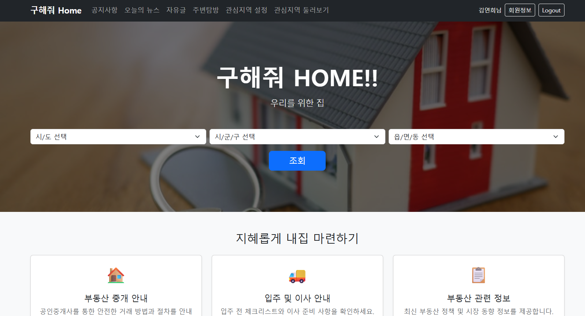
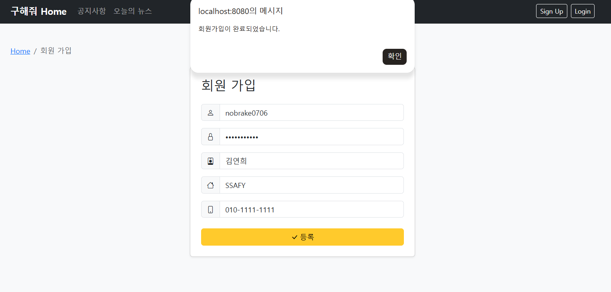
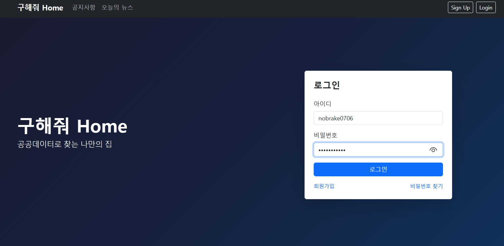
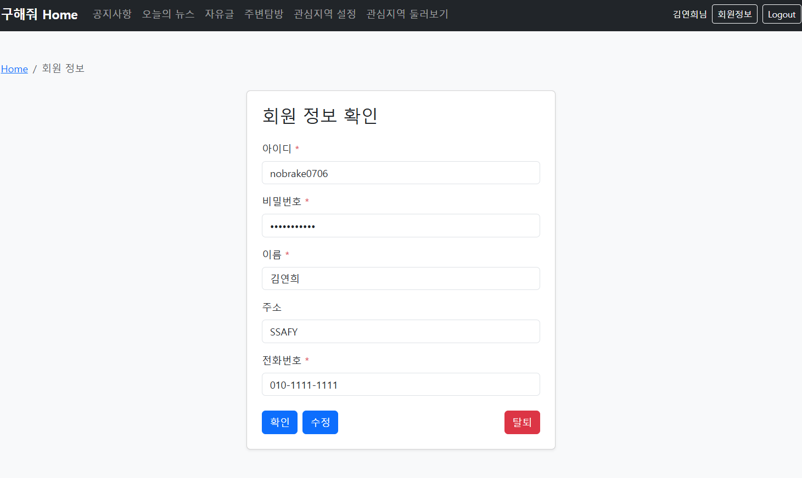
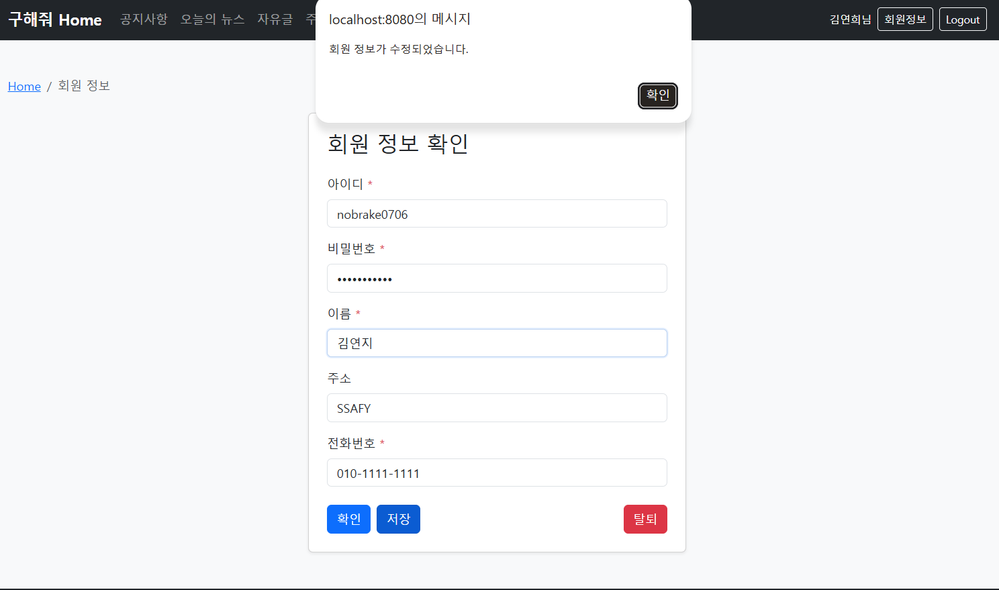
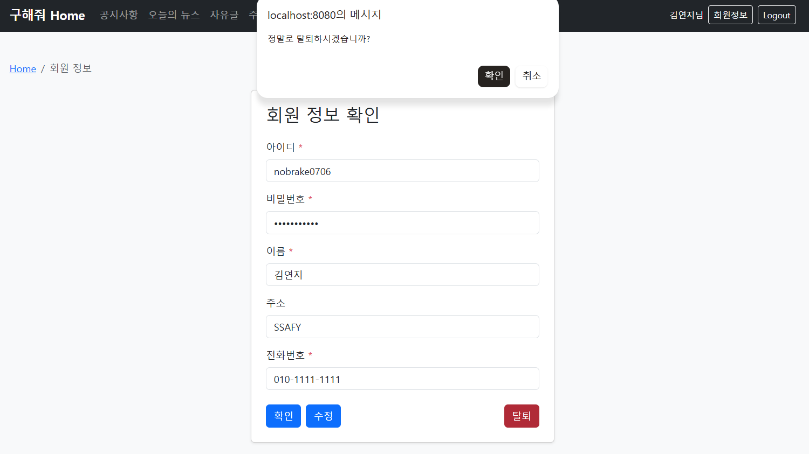
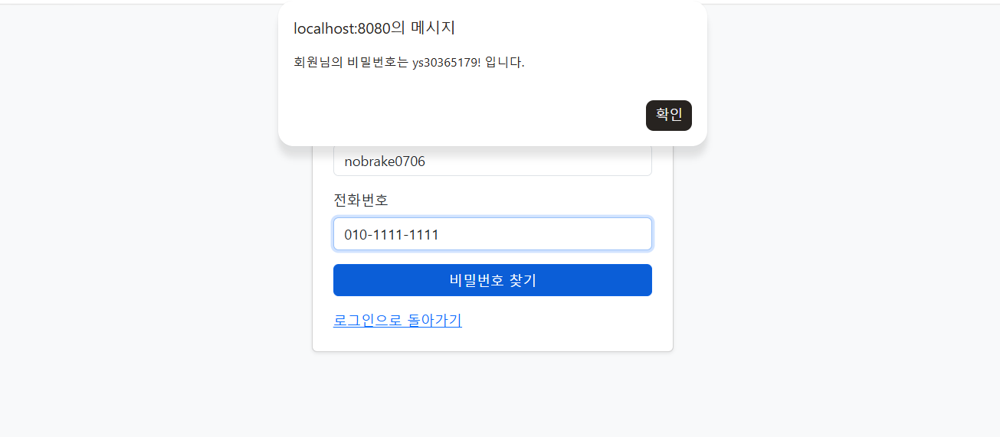

# SSAFYHome 백엔드 관통프로젝트

SSAFYHome은 사용자가 회원가입과 로그인을 통해 서비스를 이용하고,  
부동산 관련 정보와 지역 기반 탐색 기능을 제공하는 웹 프로젝트입니다.

본 프로젝트는 HTML, CSS, JavaScript 기반의 프론트엔드와  
Java Servlet 기반 백엔드를 연동하여 회원 관리 기능을 구현했습니다.

<br>

## 1. 프로젝트 개요

- Servlet 기반 백엔드 요청 처리 구조 이해
- Front Controller 방식의 요청 분기 처리
- HTML / CSS / JavaScript 기반 화면 구현
- Fetch API를 활용한 비동기 요청 처리
- Session을 이용한 로그인 상태 유지
- Filter를 이용한 인코딩 처리, 로그인 검증, 요청 로깅
- 회원가입, 로그인, 회원정보 조회/수정/탈퇴 기능 구현

<br>

## 2. 주요 기능

### 2-1. 회원가입

- 사용자가 아이디, 비밀번호, 이름, 주소, 전화번호를 입력하여 회원가입
- 필수 입력값 검증
- 비밀번호 형식 검증
  - 영문 + 숫자 조합
  - 4자 이상
- 중복 아이디 가입 방지
- 회원가입 성공 시 로그인 페이지로 이동

<br>

### 2-2. 로그인

- 아이디와 비밀번호를 입력하여 로그인
- 로그인 성공 시 서버 세션에 회원 정보 저장
- 로그인 상태에 따라 헤더 메뉴 변경
  - 비로그인 상태: Sign Up, Login 표시
  - 로그인 상태: 회원정보, Logout 표시
- 로그인 실패 시 경고 메시지 출력

<br>

### 2-3. 로그아웃

- 로그아웃 요청 시 세션 무효화
- 로그아웃 후 메인 페이지로 이동
- 헤더가 비로그인 상태로 변경

<br>

### 2-4. 회원정보 조회

- 로그인한 사용자의 회원 정보를 조회
- 세션에 저장된 로그인 회원 정보를 기준으로 회원 정보 요청
- 회원정보 페이지에서 아이디, 비밀번호, 이름, 주소, 전화번호 확인 가능
- 로그인하지 않은 사용자가 접근 시 로그인 페이지로 이동

<br>

### 2-5. 회원정보 수정

- 로그인한 사용자의 비밀번호, 이름, 주소, 전화번호 수정
- 아이디는 수정 불가
- 수정 성공 시 세션에 저장된 사용자 이름도 최신 상태로 반영
- 수정 후 읽기 전용 모드로 전환

<br>

### 2-6. 회원 탈퇴

- 로그인한 사용자의 회원 정보 삭제
- 회원 탈퇴 후 세션 무효화
- 탈퇴 완료 후 메인 페이지로 이동

<br>

### 2-7. 비밀번호 찾기

- 아이디와 전화번호를 기반으로 비밀번호 찾기
- 일치하는 회원 정보가 없을 경우 경고 메시지 출력

<br>

### 2-8. 지역 기반 탐색 UI

- 시/도, 시/군/구, 읍/면/동 선택 UI 제공
- JSON 데이터를 기반으로 지역 선택 목록 구성
- 선택한 지역 정보를 검색 페이지로 전달

<br>

### 2-8. 아파트 실거래가 조회

- 공공데이터포털(국토교통부) API를 연동하여 실시간 아파트 매매 데이터 취득
- 사용자가 선택한 지역(법정동)과 연월을 기준으로 실거래가 목록 출력
- 거래 금액, 아파트 명칭, 전용 면적, 거래 일자 등 상세 정보 제공
- 아파트 명칭을 이용한 검색 결과 내 필터링 기능

<br>

## 3. 실행 화면

### 3-0. 메인 페이지



메인 화면에서는 서비스 소개, 부동산 뉴스, 지역 선택 UI를 확인할 수 있습니다.  
로그인 여부에 따라 헤더 메뉴가 다르게 표시됩니다.

<br>

### 3-1. 회원가입



사용자가 아이디, 비밀번호, 이름, 주소, 전화번호를 입력하여 회원가입을 진행하는 화면입니다.

<br>

### 3-2. 로그인



사용자가 아이디와 비밀번호를 입력하여 로그인하는 화면입니다.  
로그인 성공 시 세션에 회원 정보가 저장되고, 메인 화면의 헤더가 로그인 상태로 변경됩니다.

<br>

### 3-3. 회원정보 조회



로그인한 사용자의 회원 정보를 확인하는 화면입니다.  
아이디, 비밀번호, 이름, 주소, 전화번호를 조회할 수 있습니다.

<br>

### 3-4. 회원정보 수정



회원정보 페이지에서 수정 버튼을 누르면 비밀번호, 이름, 주소, 전화번호를 수정할 수 있습니다.  
수정 완료 후 저장 버튼을 통해 변경 사항을 반영합니다.

<br>

### 3-5. 회원 탈퇴



회원 탈퇴 버튼을 통해 현재 로그인한 회원 정보를 삭제할 수 있습니다.  
탈퇴가 완료되면 세션이 제거되고 메인 페이지로 이동합니다.


<br>

### 3-6. 비밀번호 조회



아이디와 전화번호가 일치하면 비밀번호를 찾을 수 있습니다.
비밀번호는 알림창에서 확인할 수 있습니다.

<br>

### 3-8. 아파트 매매 내역 조회


지역을 선택하고 검색 버튼을 누르면
해당 지역의 아파트 실거래가 정보를
리스트 형식으로 확인할 수 있는 화면입니다.

<br>

## 4. 프로젝트 구조

```text
pjt_backend/
├── src/
│   └── main/
│       ├── java/
│       │   └── com/
│       │       └── ssafy/
│       │           ├── controller/
│       │           │   ├── AuthController.java
│       │           │   ├── ControllerHelper.java
│       │           │   ├── HouseController.java
│       │           │   ├── MainController.java
│       │           │   └── MemberController.java
│       │           │
│       │           ├── dto/
│       │           │   ├── HouseInfoDto.java
│       │           │   └── Member.java
│       │           │
│       │           ├── filter/
│       │           │   ├── EncodingFilter.java
│       │           │   ├── LoggingFilter.java
│       │           │   └── LoginCheckFilter.java
│       │           │
│       │           └── service/
│       │               ├── HouseService.java
│       │               ├── MemberService.java
│       │               └── MemberServiceImpl.java
│       │
│       └── webapp/
│           ├── css/
│           │   └── style.css
│           │
│           ├── data/
│           │   ├── apt-deal.json
│           │   ├── apt-rent.json
│           │   ├── multi-deal.json
│           │   ├── multi-rent.json
│           │   ├── sido.json
│           │   ├── sigungu.json
│           │   ├── emd.json
│           │   └── sigungu-coords.json
│           │
│           ├── data/
│           │   ├── footer.json
│           │   ├── header.json
│           │   ├── intro-section.json
│           │   ├── news-section.json
│           │   └── search-secion.json
│           │
│           ├── js/
│           │   └── main.js
│           │
│           ├── pages/
│           │   ├── environment.html
│           │   ├── explore.html
│           │   ├── find-pw.jsp
│           │   ├── HouseDetail.jsp
│           │   ├── interest.html
│           │   ├── login.jsp
│           │   ├── member.html
│           │   ├── notice.html
│           │   ├── old-search.html
│           │   ├── search.jsp
│           │   └── signup.html
│           │
│           ├── index.jsp
│           └── old_index.html
│
├── target/
├── pom.xml
├── .classpath
└── .project
```

## 5. 주요 클래스 설명

### 5-1. Controller

#### AuthController.java

인증 관련 요청을 처리하는 컨트롤러입니다.

- 로그인
- 로그아웃
- 로그인 상태 확인
- 아이디 찾기
- 비밀번호 찾기

<br>

#### MemberController.java

회원 관련 요청을 처리하는 컨트롤러입니다.

- 회원가입
- 회원정보 조회
- 회원정보 수정
- 회원 탈퇴

<br>

#### MainController.java

메인 페이지 요청을 처리하는 컨트롤러입니다.

- 세션 로그인 여부 확인
- 로그인 상태에 따른 데이터 전달

<br>

#### ControllerHelper.java

컨트롤러에서 공통으로 사용하는 기능을 제공합니다.

- 쿠키 및 JSON 응답 전송
- 결과 JSON 생성
- 리다이렉트 처리
- 요청 파라미터 처리

<br>

#### HouseController.java

주택 정보 검색 및 상세 조회를 제어하는 컨트롤러입니다.

- 다중 조건 필터링
- 거래 유형별 대응
- 상세 정보 제공
- 비즈니스 로직 분리

<br>

---

### 5-2. DTO

#### Member.java

회원 정보를 저장하는 DTO 클래스입니다.

- id
- password
- name
- address
- phone

<br>

#### HouseInfoDto.java

아파트 매매 정보를 관리하는 DTO 클래스입니다.

- houseName
- deposit
- monthlyRent
- dealPrice
- buildYear
- dealYear
- dealMonth
- dealDay
- dongName
- area
- jibun
- areaCode
- floor

<br>

---

### 5-3. Service

#### MemberService.java

회원 기능에 대한 서비스 인터페이스입니다.

- 회원 등록
- 회원 조회
- 회원 수정
- 회원 삭제
- 로그인
- 아이디 찾기
- 비밀번호 찾기

<br>

#### MemberServiceImpl.java

회원 기능을 실제로 처리하는 서비스 구현체입니다.

- Singleton 패턴 적용
- `ConcurrentHashMap`을 이용한 회원 정보 저장
- 회원가입, 로그인, 수정, 삭제 로직 처리

<br>

#### HouseService.java

주택 실거래 데이터의 파싱 및 가공을 담당하는 서비스 클래스 입니다.

- ObjectMapper를 이용한 JSON 트리 구조 분석 및 HouseInfoDto리스트 변환
- safeString 메서드를 통한 데이터 결측치 예외 처리
- 주택 명칭 필드의 동적 매칭 및 문자열 정제

<br>

---

### 5-4. Filter

#### EncodingFilter.java

모든 요청과 응답에 UTF-8 인코딩을 적용하는 필터입니다.

<br>

#### LoggingFilter.java

요청 URI, HTTP Method, 사용자 정보, 처리 시간을 로그로 출력하는 필터입니다.

<br>

#### LoginCheckFilter.java

로그인이 필요한 요청에 대해 세션을 확인하는 필터입니다.

- 로그인하지 않은 일반 요청은 로그인 페이지로 이동
- AJAX 요청은 401 JSON 응답 반환
- 로그인, 회원가입, 아이디 찾기, 비밀번호 찾기 요청은 검사 제외

<br>

---

## 6. 요청 URL 정리

### 6-1. 인증 관련 요청

| 기능 | Method | URL |
|---|---|---|
| 로그인 상태 확인 | GET | `/auth?action=check` |
| 로그인 | POST | `/auth?action=login` |
| 로그아웃 | POST | `/auth?action=logout` |
| 아이디 찾기 | POST | `/auth?action=findId` |
| 비밀번호 찾기 | POST | `/auth?action=findPassword` |

<br>

### 6-2. 회원 관련 요청

| 기능 | Method | URL |
|---|---|---|
| 회원가입 | POST | `/member?action=register` |
| 회원정보 조회 | GET | `/member?action=info` |
| 회원정보 수정 | POST | `/member?action=update` |
| 회원 탈퇴 | POST | `/member?action=delete` |

<br>

### 6-3. 주택 및 메인 페이지 (`/house`, `/main`)
| 기능 | Method | URL | 비고 |
|:---:|:---:|---|---|
| 메인 페이지 이동 | `GET` | `/main?action=index` | 메인 화면 호출 및 데이터 로드 |
| 실거래가 검색 | `GET` | `/house?action=search` | 지역/연월 기준 검색 데이터 반환 |

> **Note**: 모든 `POST` 요청은 `application/x-www-form-urlencoded` 형식으로 전송되며,
  서버 응답은 `JSON` 형태로 처리됩니다.

<br>

---

## 7. 기술 스택

- **Frontend**: HTML, CSS, JavaScript, Bootstrap
- **Backend**: Java Servlet, Jakarta Servlet API
- **Build Tool**: Maven
- **Server**: Apache Tomcat
- **Data**: Java Collection, JSON
- **State Management**: HttpSession
- **Communication**: Fetch API, JSON

<br>

---

## 8. 트러블 슈팅

- 한글 인코딩 문제:
  JSP 변환 후 한글 깨짐 현상을 EncodingFilter 구현 및
  JSP 상단 인코딩 선언으로 해결
- 비동기 처리: 
  Fetch API 사용 시 URLSearchParams를 활용하여
  서블릿의 파라미터 수신 방식과 일치시킴

<br>
